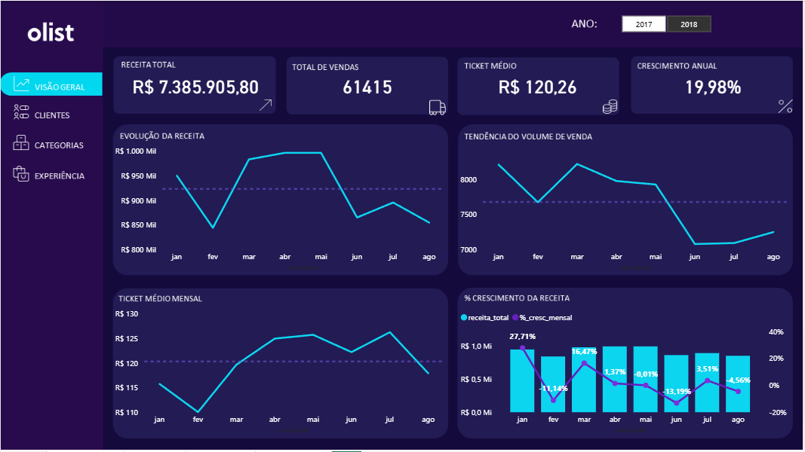
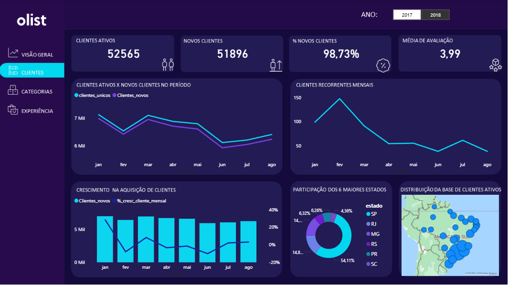
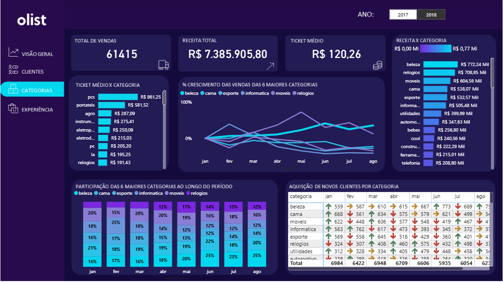
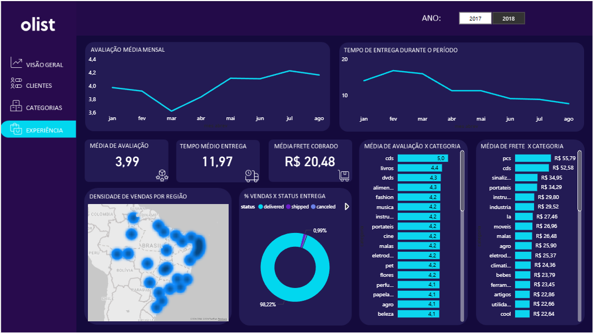

# Análise Estratégica de Vendas — Marketplace Olist

## Contexto do Projeto

Este projeto foi desenvolvido a partir de um caso de negócio onde atuei como Analista de BI com o objetivo de investigar a desaceleração no crescimento das vendas de um marketplace.

A análise foi construída utilizando a base pública da Olist, contendo dados de pedidos, clientes, vendedores, produtos, pagamentos, avaliações e logística.

O desafio consistia em transformar dados brutos em insights estratégicos capazes de responder às principais dúvidas da diretoria sobre o desempenho do negócio.

---

## Objetivo

Construir um dashboard analítico que permita:

- Acompanhar a evolução das vendas ao longo do tempo  
- Identificar os principais drivers de desempenho  
- Detectar problemas e oportunidades no negócio  
- Apoiar a tomada de decisão estratégica  

---

## Perguntas de Negócio

O projeto foi guiado pelas seguintes perguntas:

- Como as vendas evoluíram ao longo do tempo?  
- Existem períodos de crescimento ou queda?  
- Quais categorias de produto vendem mais?  
- Existem regiões com mais vendas que outras?  
- Existe relação entre avaliações e vendas?  
- O prazo de entrega impacta a satisfação dos clientes?  

---

## Arquitetura de Dados

O modelo de dados foi estruturado em formato estrela, com tabelas fato e dimensões.

### Tabelas Fato

**fato_vendas**
- pedidos, produtos, vendedores, clientes  
- valores de venda e frete  
- datas de aprovação e entrega  

**fato_review**
- avaliações dos clientes  
- notas e comentários  

### Tabelas Dimensão

- dim_cliente  
- dim_vendedores  
- dim_produtos  
- dim_localizações  

---

## Pipeline de Dados

- Base original em SQLite  
- Conversão para DuckDB  
- Conexão via ODBC com o Power BI  
- Transformações realizadas com SQL direto no modelo  

---

## Abordagem Analítica

A análise foi conduzida utilizando uma abordagem orientada a drivers, partindo do problema principal até a causa raiz:

1. Queda na receita  
2. Redução no volume de vendas  
3. Análise de clientes (aquisição vs retenção)  
4. Identificação de dependência de novos clientes  
5. Validação de hipóteses operacionais  
6. Análise por categoria  
7. Identificação da causa raiz  

---

## Principais Insights

- O crescimento desacelerou devido à queda na entrada de novos clientes  
- A retenção é extremamente baixa  
- O negócio depende quase totalmente de aquisição  
- A mudança no mix de categorias impactou diretamente o volume de novos clientes  

---

## Conclusão

A queda na receita foi causada pela redução no volume de vendas, impulsionada pela diminuição na entrada de novos clientes.

Como a base apresenta baixa retenção, o negócio depende fortemente de aquisição. A mudança no mix de categorias reduziu o volume de novos clientes, levando à queda geral de desempenho.

---

## Recomendações Estratégicas

- Reforçar categorias com alto poder de aquisição  
- Desenvolver estratégias de retenção de clientes  
- Equilibrar o mix de categorias  
- Monitorar continuamente aquisição vs retenção  

---

## Dashboard

### Visão Geral

### Clientes

### Categorias

### Experiência

---

## Ferramentas Utilizadas

- Microsoft Power BI  
- SQL  
- DuckDB  
- ODBC  

---

## Diferenciais do Projeto

- Conexão direta com banco (sem importação estática)  
- Modelagem otimizada para análise  
- Abordagem orientada a drivers de negócio  
- Foco em storytelling analítico  
- Dashboard voltado para tomada de decisão  

---

## Resultado

O dashboard permite uma visão clara e estratégica do negócio, conectando métricas operacionais a impactos reais na receita, facilitando decisões orientadas por dados.

---

## Autor

Rafael Martins  
